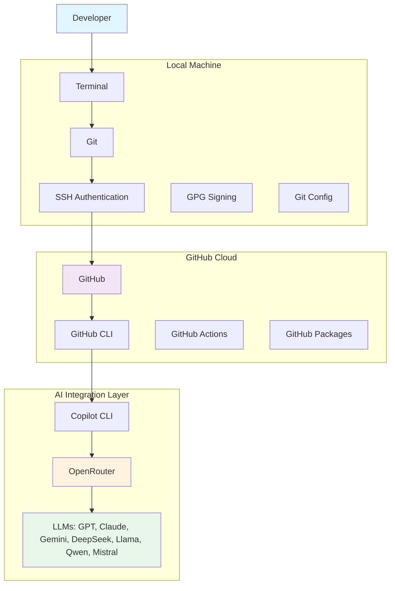
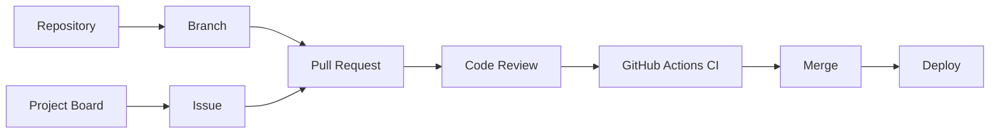
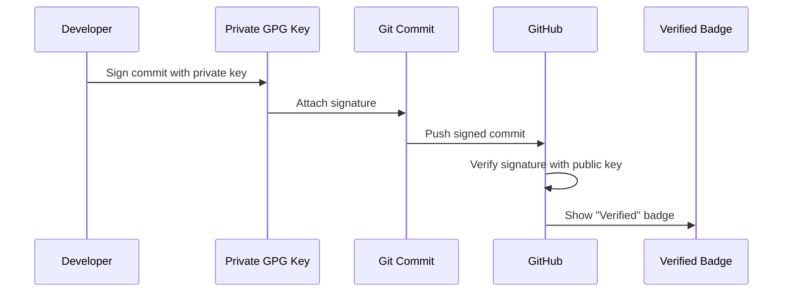
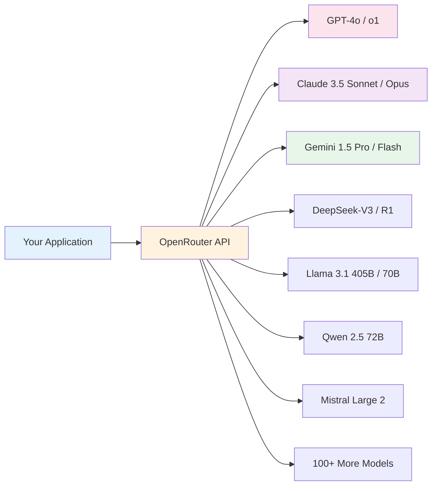

# Building a Professional GitHub Development Environment for Modern Agentic AI

> **The foundation of every great AI agent is a secure, professional development workflow. Before you write a single line of agent code, you need infrastructure that scales.**

---

## Introduction: Why This Matters

If you're reading this, you're probably excited about building AI agents. Maybe you've seen the demos—autonomous agents that write code, run tests, debug failures, and deploy applications with minimal human intervention. You want to build that.

But here's the reality every senior engineer learns the hard way: **you cannot build reliable AI agents on top of a chaotic development workflow.**

### The Hidden Prerequisite

Before a single line of agent code executes, before your first LLM call, before you even `git init` your agent project—you need a development environment that is:

- **Secure**: Your code, keys, and credentials are protected
- **Auditable**: Every change is traceable to a verified identity
- **Automatable**: Repetitive tasks happen without manual intervention
- **Portable**: Works the same on your laptop, CI/CD, and production
- **Professional**: Meets the standards companies expect from senior developers

### Why Companies Care About These Skills

When a hiring manager sees "GitHub Copilot" or "AI agent development" on a resume, they're not just looking for prompt engineering skills. They're implicitly verifying that you understand:

| Skill | Why It Matters for AI Development |
|-------|-----------------------------------|
| **Git** | Agents generate thousands of commits; you need atomic, reversible history |
| **GitHub** | PRs, Issues, Actions are the interface between human and agent workflows |
| **SSH** | Passwordless, phishing-resistant authentication for every `git push` |
| **GPG** | Cryptographic proof that *you* (or your authorized agent) authored each commit |
| **GitHub CLI** | Scriptable GitHub operations—essential for agent-driven automation |
| **Copilot CLI** | Terminal-native AI assistance that understands your repo context |
| **OpenRouter** | Model-agnostic LLM access for cost optimization and experimentation |

### This Setup Only Happens Once

The beautiful thing about this infrastructure: **you configure it once, and it serves you for years.** Every repository you create, every agent you build, every contribution you make—all benefit from this foundation.

---

## Section 2: Architecture Overview

Before diving into commands, let's visualize the complete system we're building.



### Component Breakdown

| Component | Role | Why It's Essential |
|-----------|------|-------------------|
| **Terminal** | Your primary interface | All developer tools live here; agents operate here |
| **Git** | Version control | Immutable history, branching, collaboration |
| **SSH** | Authentication | Cryptographic identity, no passwords to steal |
| **GPG** | Commit signing | Supply-chain security, verified authorship |
| **GitHub** | Remote hosting | Centralized collaboration, CI/CD, project management |
| **GitHub CLI** | Programmatic GitHub | Scriptable repos, PRs, issues, releases, Actions |
| **Copilot CLI** | Terminal AI assistant | Context-aware code generation, explanation, debugging |
| **OpenRouter** | LLM gateway | Single API for 100+ models, cost optimization, fallback |

---

## Section 3: Create a GitHub Account

### Why GitHub Exists

GitHub is more than "Git hosting." It's a **collaboration platform** built around Git that provides:

- **Repositories**: Git remotes with access control, wiki, pages
- **Branches**: Parallel development lines with protection rules
- **Pull Requests**: Code review, discussion, automated checks
- **Issues**: Task tracking, bug reports, feature requests
- **Actions**: CI/CD pipelines triggered by Git events
- **Projects**: Kanban boards, roadmaps, sprint planning
- **Packages**: Artifact registry (npm, Docker, Maven, NuGet)



### Getting Started

1. Visit **github.com** and click "Sign up"
2. Choose a **professional username** (firstname-lastname or handle you use elsewhere)
3. Use your **primary email** (the one you'll configure in Git)
4. Enable **2FA immediately** (Settings → Security → Two-factor authentication)
5. Complete your **profile**: photo, bio, website, location

> 💡 **Pro Tip**: Use a personal email, not a work/school email. You own this identity for your career.

---

## Section 4: Install Git

### What Is Git?

Git is a **distributed version control system** created by Linus Torvalds in 2005 for Linux kernel development. Before Git, developers used centralized systems (CVS, SVN) where:
- A single server held the "truth"
- Network required for most operations
- Branching/merging was painful

**Git changed everything:**
- Every clone is a complete repository with full history
- Branching is cheap and instantaneous
- Merging is intelligent (three-way merge)
- Works offline

### Git vs GitHub: The Critical Distinction

```
Git = The tool (version control software)
GitHub = The service (remote hosting + collaboration features)
```

Think of it like: **Git is email; GitHub is Gmail**. You can use Git without GitHub (self-hosted, GitLab, Bitbucket), but GitHub adds the collaboration layer.

### Version Control: A Concrete Example

Imagine you're building an AI agent. You've written 2,000 lines of orchestration code. Then you try a "quick refactor" and accidentally delete the core planning module.

**Without Git:** Panic. Restore from backup? Hope your editor has undo history? Rewrite from memory?

**With Git:**
```bash
# See what happened
git log --oneline -10

# Restore the deleted file from 3 commits ago
git restore -s HEAD~3 -- src/agent/planner.py

# Or reset the entire repo to a known good state
git reset --hard HEAD~3
```

### Installation & Verification

```bash
# Ubuntu/Debian
sudo apt update && sudo apt install git

# Fedora
sudo dnf install git

# Arch
sudo pacman -S git

# macOS (Homebrew)
brew install git

# Windows (winget)
winget install Git.Git
```

Verify:
```bash
git --version
# Output: git version 2.47.0
```

> ✅ **What this means**: You have Git 2.47 (released 2024) with all modern features: `git switch`, `git restore`, `git worktree`, credential helpers, and more.

---

## Section 5: Generate an SSH Key

### What Is SSH?

SSH (Secure Shell) is a **cryptographic network protocol** for secure communication over unsecured networks. For Git, it replaces password authentication with **public-key cryptography**.

### Public-Key Cryptography: The Mental Model

```
┌─────────────────────────────────────────────────────────────┐
│                    YOUR COMPUTER                            │
│  ┌─────────────────┐         ┌─────────────────┐           │
│  │  PRIVATE KEY    │         │  PUBLIC KEY     │           │
│  │  (id_ed25519)   │────────▶│  (id_ed25519.pub)           │
│  │  NEVER SHARE    │  derives│  SHARE FREELY   │           │
│  └─────────────────┘         └────────┬────────┘           │
└───────────────────────────────────────│────────────────────┘
                                         │
                                         ▼
┌─────────────────────────────────────────────────────────────┐
│                      GITHUB                                 │
│  ┌─────────────────────────────────────────────────────┐   │
│  │  Authorized Keys: [your-public-key]                 │   │
│  │  When you connect:                                  │   │
│  │    1. GitHub sends a challenge encrypted with       │   │
│  │       your public key                               │   │
│  │    2. Only your private key can decrypt it          │   │
│  │    3. You respond correctly → access granted        │   │
│  └─────────────────────────────────────────────────────┘   │
└─────────────────────────────────────────────────────────────┘
```

### Why Ed25519?

| Algorithm | Key Size | Security | Speed | Recommendation |
|-----------|----------|----------|-------|----------------|
| RSA | 4096-bit | Good | Slow | Legacy compatibility only |
| ECDSA | 256-bit | Good | Fast | NIST curves (concerns) |
| **Ed25519** | **256-bit** | **Excellent** | **Fastest** | **✅ Default choice** |

Ed25519 uses **Edwards-curve Digital Signature Algorithm** with Curve25519—designed for speed, security, and resistance to side-channel attacks.

### Generate Your Key

```bash
# Generate Ed25519 key with your GitHub email as comment
ssh-keygen -t ed25519 -C "your.email@example.com"
```

**What each flag does:**
- `-t ed25519`: Algorithm (Ed25519)
- `-C "email"`: Comment field (identifies the key in GitHub UI)

**Interactive prompts:**
```
Generating public/private ed25519 key pair.
Enter file in which to save the key (/home/user/.ssh/id_ed25519): [Press Enter]
Enter passphrase (empty for no passphrase): [USE A STRONG PASSPHRASE]
Enter same passphrase again: [Confirm]
```

> 🔐 **Why a passphrase?** Without one, anyone with filesystem access to your `~/.ssh/id_ed25519` can impersonate you on GitHub. A passphrase encrypts the private key at rest.

### Add to SSH Agent

The `ssh-agent` caches your decrypted key in memory so you don't re-enter the passphrase constantly.

```bash
# Start the agent (if not running)
eval "$(ssh-agent -s)"

# Add your key (prompts for passphrase once)
ssh-add ~/.ssh/id_ed25519
```

**What `ssh-agent` does:**
- Runs as a background daemon
- Holds decrypted private keys in memory
- Communicates via Unix socket (`$SSH_AUTH_SOCK`)
- `ssh`/`git` automatically query it for keys

> 💡 **Persist across reboots**: Add `eval "$(ssh-agent -s)" && ssh-add ~/.ssh/id_ed25519` to your shell config (`.bashrc`, `.zshrc`, `config.fish`).

---

## Section 6: Add the SSH Key to GitHub

### Why GitHub Needs Your Public Key

GitHub stores your public key in your account settings. When you `git push`:
1. Your SSH client offers your public key
2. GitHub checks if it's in your authorized keys
3. GitHub sends a challenge encrypted with that public key
4. Your private key decrypts it → you prove identity without sending secrets

### Copy Your Public Key

```bash
cat ~/.ssh/id_ed25519.pub
# Output: ssh-ed25519 AAAAC3NzaC1lZDI1NTE5AAAAI... your.email@example.com
```

**What is a `.pub` file?** It's the **public portion** of your key pair—safe to share, used by others to encrypt challenges only your private key can decrypt.

### Add to GitHub (Step by Step)

1. **Settings** (top-right avatar → Settings)
2. **SSH and GPG keys** (left sidebar)
3. **New SSH key** (green button)
4. **Title**: "Work Laptop - $(hostname)" (descriptive!)
5. **Key type**: Authentication Key
6. **Paste** the output from `cat ~/.ssh/id_ed25519.pub`
7. **Add SSH key** (may prompt for GitHub password/2FA)

### Test the Connection

```bash
ssh -T git@github.com
```

**Expected output:**
```
Hi yourusername! You've successfully authenticated, but GitHub does not provide shell access.
```

> ✅ **Success!** The "no shell access" message is normal—GitHub only allows Git operations over SSH.

### Troubleshooting Common SSH Errors

| Error | Cause | Fix |
|-------|-------|-----|
| `Permission denied (publickey)` | Wrong key, agent not running, key not added to GitHub | `ssh-add -l` to list keys; verify in GitHub settings |
| `Bad permissions` | Private key file too open | `chmod 600 ~/.ssh/id_ed25519` |
| `Agent admitted failure to sign` | Key not in agent | `ssh-add ~/.ssh/id_ed25519` |
| `Host key verification failed` | GitHub's host key changed (rare) | `ssh-keygen -R github.com` then retry |

---

## Section 7: Configure GPG Signing

### What Is GPG?

GPG (GNU Privacy Guard) implements the **OpenPGP standard** for encryption and signing. For Git, we use it to **cryptographically sign commits**—proving they came from you.

### Why Signed Commits Matter

```
┌──────────────────────────────────────────────────────────────┐
│                    SUPPLY CHAIN ATTACK                       │
│                                                              │
│  Attacker compromises a maintainer's GitHub token           │
│  → Pushes malicious code to popular package                 │
│  → Thousands of projects auto-update                        │
│  → Malware spreads globally                                 │
│                                                              │
│  WITH GPG SIGNING:                                          │
│  → Commit lacks valid signature from maintainer's key       │
│  → GitHub shows "Unverified" warning                        │
│  → CI/CD rejects unsigned commits                           │
│  → Attack blocked                                           │
└──────────────────────────────────────────────────────────────┘
```

### The Verification Flow



### Generate a GPG Key

```bash
gpg --full-generate-key
```

**Interactive prompts with recommendations:**

```
Please select what kind of key you want:
   (1) RSA and RSA (default)
   (2) DSA and Elgamal
   (3) DSA (sign only)
   (4) RSA (sign only)
   (9) ECC (sign and encrypt) *default*
   (10) ECC (sign only)
   (14) Existing key from card
Your selection? 1

RSA keys may be between 1024 and 4096 bits long.
What keysize do you want? (3072) 4096

Please specify how long the key should be valid.
         0 = key does not expire
      <n>  = key expires in n days
      <n>w = key expires in n weeks
      <n>m = key expires in n months
      <n>y = key expires in n years
Key is valid for? (0) 2y

Real name: Your Name
Email address: your.email@example.com
Comment: GitHub Signing Key
Change (N)ame, (C)omment, (E)mail or (O)kay/(Q)uit? O

You need a Passphrase to protect your secret key.
Enter passphrase: [STRONG PASSPHRASE - different from SSH!]
```

**Why these choices?**
- **RSA 4096-bit**: Maximum compatibility (GitHub, GitLab, all Git tools)
- **2-year expiration**: Forces periodic rotation (security best practice)
- **Separate passphrase**: Defense in depth—if SSH key compromised, GPG still safe

### Find Your Key ID

```bash
gpg --list-secret-keys --keyid-format LONG
```

**Output:**
```
sec   rsa4096/ABC123DEF4567890 2026-07-27 [SC] [expires: 2028-07-27]
      1234567890ABCDEF1234567890ABCDEF12345678
uid                 [ultimate] Your Name (GitHub Signing Key) <your.email@example.com>
ssb   rsa4096/FEDCBA0987654321 2026-07-27 [E] [expires: 2028-07-27]
```

**Your Key ID is `ABC123DEF4567890`** (the 16-char hex after `rsa4096/`).

### Export Public Key (ASCII Armor)

```bash
gpg --armor --export ABC123DEF4567890
```

**What is ASCII armor?** Base64-encoded binary data wrapped in `-----BEGIN PGP PUBLIC KEY BLOCK-----` headers—safe for copy/paste, email, web forms.

### Add to GitHub

1. **Settings** → **SSH and GPG keys**
2. **New GPG key**
3. **Paste** the entire armored output (including headers)
4. **Add GPG key**

---

## Section 8: Configure Git

### Global Configuration Commands

```bash
# Your identity (matches GitHub account)
git config --global user.name "Your Name"
git config --global user.email "your.email@example.com"

# Your GPG signing key (the 16-char Key ID from above)
git config --global user.signingkey ABC123DEF4567890

# Sign ALL commits by default
git config --global commit.gpgsign true

# Use SSH for GitHub (not HTTPS)
git config --global url."git@github.com:".insteadOf "https://github.com/"

# Better defaults for modern Git
git config --global init.defaultBranch main
git config --global pull.rebase false
git config --global fetch.prune true
git config --global diff.colorMoved default
```

### Why Each Configuration Exists

| Config | Purpose | Why It Matters |
|--------|---------|----------------|
| `user.name` | Author name in commits | Professional identity, attribution |
| `user.email` | Author email in commits | Links to GitHub account, notifications |
| `user.signingkey` | Which GPG key to use | Unambiguous key selection |
| `commit.gpgsign true` | Auto-sign every commit | No forgotten signatures, supply-chain security |
| `url.*.insteadOf` | Rewrite HTTPS→SSH | Never accidentally use HTTPS (password/token) |
| `init.defaultBranch main` | New repos use `main` | Modern default, inclusive naming |
| `pull.rebase false` | Merge on pull (not rebase) | Preserves history, safer for beginners |
| `fetch.prune true` | Auto-clean deleted remotes | Keeps local branches tidy |
| `diff.colorMoved` | Highlight moved code | Easier review of refactored code |

### Config Scopes: Global vs Repository vs System

```bash
# System: /etc/gitconfig (all users, all repos) - requires sudo
git config --system core.editor vim

# Global: ~/.gitconfig (your user, all repos) - YOUR DAILY DRIVER
git config --global user.name "Your Name"

# Repository: .git/config (this repo only) - OVERRIDES
git config user.email "work@company.com"  # Different email for work repo
```

**Precedence**: Repository > Global > System

> 💡 **Pro Tip**: Use `--global` for personal settings. Use repository config for work-specific overrides (different email, signing key).

### Verify Your Config

```bash
git config --list --show-origin
```

---

## Section 9: Install GitHub CLI

### Why GitHub CLI (`gh`)?

The browser is great for *reading*. The CLI is essential for *automating*.

| Task | Browser | `gh` CLI |
|------|---------|----------|
| Create repo | 5 clicks | `gh repo create` |
| Clone repo | Copy URL, paste | `gh repo clone owner/repo` |
| Create PR | 6+ clicks | `gh pr create --fill` |
| View PR checks | Navigate UI | `gh pr checks` |
| Trigger workflow | Click "Run" | `gh workflow run` |
| Create release | Form + upload | `gh release create v1.0.0 dist/*` |
| Script anything | ❌ | ✅ Full API access |

### Installation

```bash
# Ubuntu/Debian
sudo apt update && sudo apt install gh

# Fedora
sudo dnf install gh

# Arch
sudo pacman -S github-cli

# macOS
brew install gh

# Windows
winget install GitHub.cli
# or: choco install gh
# or: scoop install gh
```

### Authenticate

```bash
gh auth login
```

**Interactive prompts:**
```
? What account do you want to log into? GitHub.com
? What is your preferred protocol for Git operations? SSH
? Upload your SSH public key to your GitHub account? Yes (select your key)
? How would you like to authenticate? Login with a web browser
```

**What happens:**
1. Opens browser to `github.com/login/device`
2. You enter the displayed code
3. `gh` stores token in `~/.config/gh/hosts.yml`
4. Configures Git to use `gh` as credential helper

### Essential `gh` Workflows

```bash
# Create a new repository (private, with README, clone locally)
gh repo create my-agent --private --clone --readme

# Create and push a feature branch
git switch -c feature/planning-module
# ... make changes ...
git commit -am "Add planning module"
gh pr create --fill --base main

# View PR status and checks
gh pr view --web
gh pr checks

# Merge when ready (squash, delete branch)
gh pr merge --squash --delete-branch

# Work with issues
gh issue create --title "Add memory module" --body "..." --label enhancement
gh issue list --state open --assignee @me

# Run GitHub Actions workflow
gh workflow run ci.yml --ref feature/planning-module
gh run watch

# Create a release
gh release create v1.0.0 --title "v1.0.0" --notes-file CHANGELOG.md dist/*
```

### Why AI Developers Use `gh` Constantly

AI agents need to:
- **Create repos** for each experiment
- **Open PRs** for code review (human or agent)
- **Trigger CI** to test agent-generated code
- **Read logs** from failed runs
- **Create issues** for bugs the agent finds
- **Manage releases** of agent-built artifacts

`gh` makes all of this **scriptable**—the foundation of agent-driven development.

---

## Section 10: Install GitHub Copilot CLI

### What Is GitHub Copilot?

Copilot is **GitHub's AI pair programmer**—but it's not just one thing:

| Feature | Description | Where It Lives |
|---------|-------------|----------------|
| **Autocomplete** | Inline code suggestions as you type | IDE (VS Code, JetBrains, Neovim) |
| **Chat** | Conversational coding assistant | IDE sidebar, GitHub.com, GitHub Mobile |
| **Terminal (CLI)** | Command-line AI for shell, Git, GitHub | `gh copilot` (this section) |
| **Code Review** | AI-powered PR reviews | GitHub PR interface |
| **Workspaces** | Multi-file context for complex tasks | VS Code, GitHub Codespaces |

### How Copilot Differs from Other AI Tools

| Aspect | Copilot | ChatGPT | Cursor | Claude Code |
|--------|---------|---------|--------|-------------|
| **Context** | Your entire repo (IDE) | Only what you paste | Your repo (IDE) | Your repo (terminal) |
| **Git Integration** | Native (PRs, commits) | None | Good | Good |
| **Terminal Native** | `gh copilot` | No | No | Yes |
| **Enterprise Features** | Org policies, audit logs | Limited | Limited | Limited |
| **Cost Model** | Per seat/month | Per token | Per seat/month | Per token |

> 💡 **Key insight**: Copilot's superpower is **repository context awareness**—it knows your codebase, not just the current file.

### Install Copilot CLI Extension

```bash
# Requires: gh auth login (done in Section 9)
gh extension install github/gh-copilot
```

**What this does:** Downloads the `gh-copilot` binary, installs as `gh copilot` subcommand.

### Authenticate Copilot

```bash
gh copilot auth
# Opens browser → authorize → token stored securely
```

### Core Commands

```bash
# Get command suggestions (shell, git, gh, docker, etc.)
gh copilot suggest "write a dockerfile for python fastapi"
gh copilot suggest "git rebase interactive last 5 commits"

# Explain any command
gh copilot explain "git rebase --interactive HEAD~5"
gh copilot explain "docker build -t myapp ."

# Alias for convenience (add to shell config)
alias copilot='gh copilot suggest'
alias explain='gh copilot explain'
```

### When to Use Each

| Command | Use Case |
|---------|----------|
| `gh copilot suggest` | "How do I...?" — need a command, script, or snippet |
| `gh copilot explain` | "What does this do?" — decipher complex flags, pipes, regex |

> 💡 **Pro Tip**: `gh copilot suggest` respects context. Run it *inside* a Git repo and it knows your remotes, branches, and recent commits.

---

## Section 11: Configure OpenRouter

### What Is OpenRouter?

OpenRouter is a **unified LLM API gateway**—one API key, one endpoint, access to 100+ models from OpenAI, Anthropic, Google, Meta, Mistral, DeepSeek, Qwen, and more.

### Why Developers Use OpenRouter

| Benefit | Description |
|---------|-------------|
| **One API** | Single integration, swap models by changing a string |
| **Many Models** | GPT-4o, Claude 3.5 Sonnet, Gemini 1.5, Llama 3.1, DeepSeek-V3, Qwen 2.5, Mistral Large... |
| **Lower Costs** | Competitive pricing, often cheaper than direct |
| **Experimentation** | A/B test models in production with one line change |
| **Model Routing** | Automatic fallback, load balancing, cost optimization |
| **No Vendor Lock-in** | Switch providers without code changes |

### The OpenRouter Architecture



### API Keys & Environment Variables

```bash
# Get your key from: openrouter.ai/keys
export OPENROUTER_API_KEY="sk-or-v1-abcdef1234567890..."

# Optional: Set default model (can override per-request)
export OPENROUTER_DEFAULT_MODEL="anthropic/claude-3.5-sonnet"

# Optional: Your site/app name for analytics
export OPENROUTER_SITE_NAME="my-agent-project"
export OPENROUTER_SITE_URL="https://github.com/yourname/my-agent"
```

### Why Environment Variables Over Hardcoding?

```python
# ❌ BAD: Hardcoded in source (commits to Git, exposed in logs)
client = OpenAI(api_key="sk-or-v1-abcdef...", base_url="https://openrouter.ai/api/v1")

# ✅ GOOD: From environment (never in source, works in CI/CD, containers)
import os
client = OpenAI(
    api_key=os.getenv("OPENROUTER_API_KEY"),
    base_url="https://openrouter.ai/api/v1"
)
```

| Reason | Explanation |
|--------|-------------|
| **Security** | Keys never in Git history, Docker images, logs |
| **Portability** | Same code runs locally, CI, staging, prod |
| **Rotation** | Change key in one place (env), no code deploy |
| **Secrets Management** | Works with Vault, 1Password, GitHub Actions secrets |

> 🔐 **Best Practice**: Use a `.env` file locally (add to `.gitignore`), and platform secrets in CI/CD (GitHub Actions: `Settings → Secrets → Actions`).

---

## Section 12: Can Copilot CLI Use OpenRouter?

### The Short Answer: **No.**

GitHub Copilot CLI **cannot** use OpenRouter or any custom LLM provider.

### Why Not?

| Reason | Explanation |
|--------|-------------|
| **GitHub Backend** | Copilot routes through GitHub's proprietary inference infrastructure |
| **Authentication** | Tied to your GitHub account/subscription, not an API key |
| **Subscription Model** | You pay GitHub per seat; they manage model costs/licensing |
| **Data Policy** | GitHub controls telemetry, training data opt-out, enterprise compliance |
| **Model Curation** | GitHub selects/optimizes models for coding tasks specifically |

This is a **deliberate product decision**—Copilot is a managed service, not a BYOM (Bring Your Own Model) platform.

### Alternatives That Support OpenRouter

| Tool | OpenRouter | Multi-Provider | Terminal | Git Integration | Cost Model | Best For |
|------|------------|----------------|----------|-----------------|------------|----------|
| **Aider** | ✅ Native | ✅ | ✅ | ✅ (auto-commits) | BYOK (pay per token) | Terminal-first agentic coding |
| **Claude Code** | ✅ Via API | ✅ | ✅ | ✅ | BYOK / Subscription | Anthropic-centric workflows |
| **OpenAI Codex CLI** | ❌ | ❌ | ✅ | ✅ | Subscription | OpenAI ecosystem |
| **Gemini CLI** | ❌ | ❌ | ✅ | ⚠️ Limited | Free tier / BYOK | Google ecosystem |
| **Copilot CLI** | ❌ | ❌ | ✅ | ✅ Native | Per seat/month | GitHub-native teams |
| **Continue.dev** | ✅ | ✅ | ✅ IDE + Terminal | ✅ | BYOK / Free | Local-first, privacy-focused |

### Recommendation by Use Case

| If You Want... | Use This |
|----------------|----------|
| **GitHub-native, zero config, team collaboration** | Copilot CLI + IDE |
| **Full model control, terminal agent, cost optimization** | Aider + OpenRouter |
| **Best reasoning model (Claude), terminal-native** | Claude Code |
| **Local-first, privacy, run models on your GPU** | Continue.dev + Ollama |
| **Experiment with 50+ models, A/B test in prod** | Custom OpenRouter integration |

> 💡 **My Setup**: Copilot in IDE (autocomplete/chat), **Aider + OpenRouter** in terminal for agentic workflows. Best of both worlds.

---

## Section 13: Best Practices Checklist

### Security Non-Negotiables

```markdown
☐ **Never commit private keys** (SSH, GPG, API keys, .env files)
☐ **Never commit API keys** — use environment variables + secret managers
☐ **Use .gitignore** — global + per-repo (see template below)
☐ **Rotate keys periodically** — SSH yearly, GPG per expiration, API keys quarterly
☐ **Enable 2FA everywhere** — GitHub, OpenRouter, cloud providers, email
☐ **Use strong passphrases** — SSH key, GPG key, password manager
☐ **Sign all commits** — `git config --global commit.gpgsign true`
☐ **Verify SSH connections** — check fingerprints on first connect
☐ **Back up GPG keys securely** — paperkey, encrypted USB, password manager
```

### Global `.gitignore` Template

```bash
# Create global ignore file
git config --global core.excludesfile ~/.gitignore_global

# Add these patterns
cat > ~/.gitignore_global << 'EOF'
# Secrets & Keys
*.pem
*.key
*.p12
*.pfx
.env
.env.*
!.env.example
.secrets/
*.kdbx

# SSH/GPG
.ssh/id_*
!.ssh/*.pub
.gnupg/

# IDE/Editor
.vscode/
.idea/
*.swp
*.swo
*~

# OS
.DS_Store
Thumbs.db

# Logs/Build
*.log
dist/
build/
*.pyc
__pycache__/
node_modules/

# Local config
local.config.*
*.local.*
EOF
```

### Key Rotation Schedule

| Key Type | Rotation | Process |
|----------|----------|---------|
| SSH (Ed25519) | Yearly | `ssh-keygen -t ed25519` → add new → remove old |
| GPG (RSA 4096) | Per expiry (2y) | Generate new → publish → revoke old → update Git config |
| API Keys | Quarterly | Generate new → update secrets → revoke old |
| GitHub PAT | 90 days (max) | `gh auth refresh` or regenerate in settings |

---

## Section 14: Troubleshooting Guide

### SSH Issues

| Problem | Likely Cause | Resolution |
|---------|--------------|------------|
| `Permission denied (publickey)` | Key not in agent / wrong key / not on GitHub | `ssh-add -l` → `ssh-add ~/.ssh/id_ed25519` → verify in GitHub settings |
| `Agent admitted failure to sign` | Key not loaded in agent | `ssh-add ~/.ssh/id_ed25519` |
| `Bad permissions` | Private key world-readable | `chmod 600 ~/.ssh/id_ed25519 ~/.ssh/id_ed25519.pub` |
| `Host key verification failed` | GitHub key changed (rare) | `ssh-keygen -R github.com` → retry |
| `Connection timeout` | Firewall/proxy blocking port 22 | Use HTTPS with PAT, or configure proxy |

### GPG Issues

| Problem | Likely Cause | Resolution |
|---------|--------------|------------|
| `gpg: signing failed: Inappropriate ioctl for device` | No TTY for passphrase prompt | `export GPG_TTY=$(tty)` in shell config |
| `gpg: no default secret key` | `user.signingkey` not set | `git config --global user.signingkey YOUR_KEY_ID` |
| `error: gpg failed to sign the data` | Wrong key ID / expired key | `gpg --list-secret-keys` → verify Key ID and expiry |
| `Verification failed` on GitHub | Public key not uploaded / wrong key | Re-export with `--armor` → re-upload to GitHub |

### GitHub CLI Issues

| Problem | Likely Cause | Resolution |
|---------|--------------|------------|
| `gh auth login` fails | Browser not opening / wrong account | `gh auth login --web` or `gh auth login --with-token < token.txt` |
| `gh: command not found` | Not in PATH | Reinstall, verify `/usr/bin/gh` or `~/.local/bin/gh` in PATH |
| `API rate limit exceeded` | Unauthenticated requests | `gh auth status` → re-authenticate |
| `Could not resolve host` | DNS / network | Check internet, try `gh api user` |

### Copilot CLI Issues

| Problem | Likely Cause | Resolution |
|---------|--------------|------------|
| `gh copilot: command not found` | Extension not installed | `gh extension install github/gh-copilot` |
| `authentication required` | Token expired | `gh copilot auth` |
| `rate limit` | Too many requests | Wait, or check GitHub Copilot quota |
| `suggestion not relevant` | No repo context | Run inside a Git repository |

### OpenRouter Issues

| Problem | Likely Cause | Resolution |
|---------|--------------|------------|
| `401 Unauthorized` | Invalid/expired API key | Regenerate at openrouter.ai/keys → update env |
| `402 Payment Required` | Insufficient credits | Add credits at openrouter.ai/credits |
| `404 Model not found` | Wrong model ID format | Use `provider/model` (e.g., `anthropic/claude-3.5-sonnet`) |
| `Timeout` | Model overloaded | Add `fallback` param or retry with different model |

---

## Section 15: Conclusion

### What You've Built

You now have a **production-grade development foundation**:

```
✅ GitHub Account — Your professional identity
✅ Git — Distributed version control
✅ SSH (Ed25519) — Phishing-resistant authentication
✅ GPG (RSA 4096) — Cryptographic commit signing
✅ Git Config — Sensible defaults, auto-signing
✅ GitHub CLI — Scriptable GitHub operations
✅ Copilot CLI — Terminal-native AI assistance
✅ OpenRouter — Model-agnostic LLM gateway
✅ Security Practices — Keys, rotation, 2FA, .gitignore
```

### How Each Piece Serves Your AI Agent Journey

| Component | Agent Development Role |
|-----------|------------------------|
| **Git + GitHub** | Every agent experiment is a branch; every capability a PR |
| **SSH/GPG** | Agents push signed commits—auditable, verifiable autonomy |
| **GitHub CLI** | Agents create repos, PRs, issues, trigger CI programmatically |
| **Copilot CLI** | You orchestrate agents from terminal with AI assistance |
| **OpenRouter** | Your agents swap models for cost/quality without code changes |

### Your Setup Verification Checklist

```bash
# Run these to verify everything works
git --version                    # ≥ 2.40
ssh -T git@github.com            # "Hi username!"
gpg --list-secret-keys           # Shows your RSA 4096 key
git config --list | grep -E "user\.|commit\.gpgsign|url\."
gh auth status                   # "Logged in to github.com"
gh copilot suggest "test"        # Returns suggestion
echo $OPENROUTER_API_KEY         # Shows key (not empty)
```

---

### What's Next?

> **🚀 Next Article: "Building Your First AI Agent with Python"**
>
> Now that your infrastructure is solid, we'll build a **complete autonomous agent** from scratch:
> - Planning & reasoning loops
> - Tool use (file ops, shell, web search, API calls)
> - Memory & context management
> - Self-correction & error recovery
> - GitHub integration (create PRs, run tests, deploy)
> - Multi-agent orchestration
>
> **All running on the foundation you just built.**

---

### Final Thought

> *"Give me six hours to chop down a tree and I will spend the first four sharpening the axe."*
> — **Abraham Lincoln** (attributed)

You just spent time sharpening your axe. Every agent you build, every contribution you make, every career opportunity—**they all compound on this foundation**.

Welcome to professional AI engineering. 🛠️

---

*This post is part of the "Modern AI Agent Development" series. Next: Building Your First AI Agent with Python.*